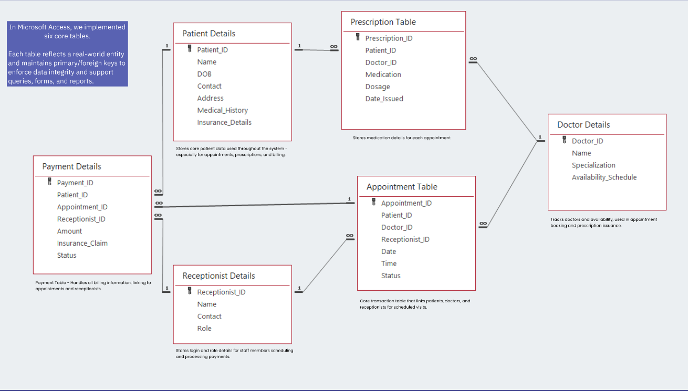

# Medical Appointment and Patient Record System

A comprehensive database management system designed to streamline healthcare operations by efficiently managing patient records, doctor schedules, appointments, prescriptions, and billing.

## Overview

The Medical Appointment and Patient Record System addresses critical challenges in healthcare management by providing an integrated solution for tracking patient data, scheduling appointments, and managing medical records. This system enables healthcare providers to improve operational efficiency, enhance patient care, and streamline administrative workflows.

## Features

- **Patient Management**
  - Complete patient demographics
  - Medical history tracking
  - Insurance information management

- **Doctor Scheduling**
  - Availability management
  - Specialization mapping
  - Time slot allocation

- **Appointment System**
  - Real-time scheduling
  - Status tracking (confirmed, cancelled, completed)
  - Patient-doctor relationship management

- **Prescription Tracking**
  - Medication details and dosage
  - Prescription history
  - Doctor-patient association

- **Payment Processing**
  - Insurance claims management
  - Self-pay transaction tracking
  - Payment status monitoring

- **Reporting & Analytics**
  - Appointment trends visualization
  - Revenue tracking
  - Resource utilization metrics
  - Cancellation pattern analysis

## Database Schema

Our system is built on a normalized database design with six primary entities:

### Entity Relationships

- Patients can have multiple appointments with different doctors
- Doctors manage their availability schedules
- Appointments link patients, doctors, and receptionists
- Prescriptions are always associated with both a doctor and patient
- Payments are linked to specific appointments

## Technology Stack

- **Database Management**: Oracle Database/MS Access
- **Query Language**: SQL
- **Forms & Interface**: Oracle APEX
- **Report Generation**: Crystal Reports

## Project Team

- **Anisha Mogal & Saifuddin Ahmed** - Project Managers
- **Parth Chaudhari** - Database Design
- **Akshith Kamatala** - GUI Implementation
- **Faseeh Ahmed Mohammad & Praneet Naik** - Query and Report Development

## Future Enhancements

- Integration with telemedicine platforms
- Mobile application for patient appointment management
- Automated appointment reminders via SMS/Email
- Enhanced analytics for predictive patient care
- Integration with electronic health record (EHR) systems

## License

This project is licensed under the MIT License - see the LICENSE file for details.

## Acknowledgments

- Rochester Institute of Technology
- Professor Saiwu Lin, MGIS725 - Data Management and Analytics
